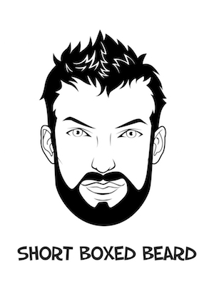
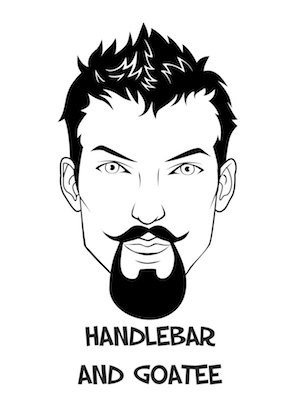
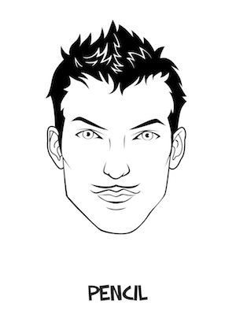
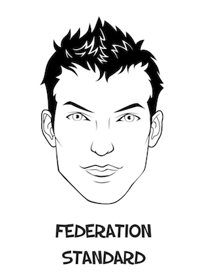
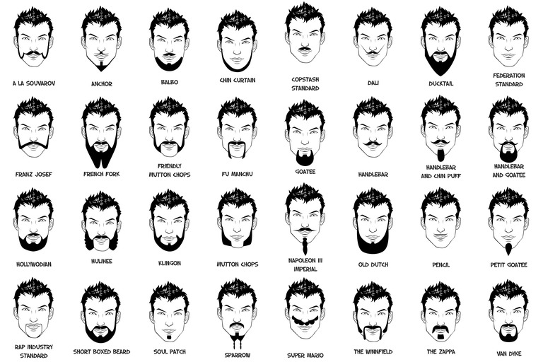
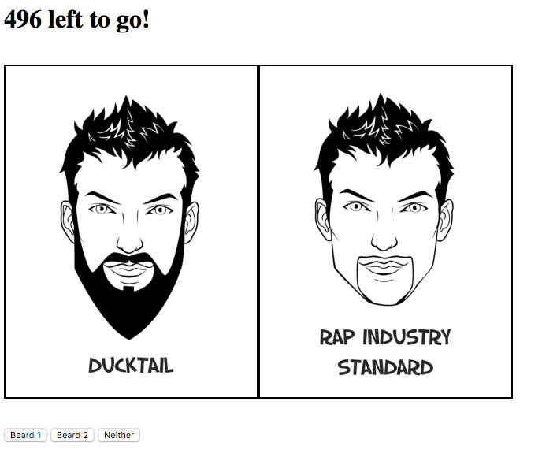
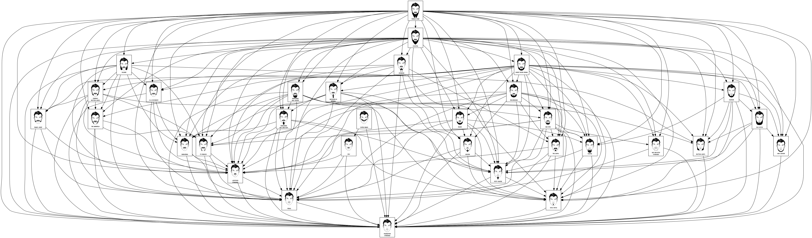
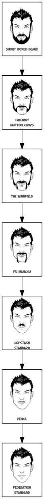

Every man wonders: "How many facial hair styles can I get from full beard?" 
Today, we have that answer. In short, we've constructed a full graph of all stachepaths. 
That is, a list of ways you  can shave from beard style X to beard style Y.

First, some definitions:

stachepath
    : the facial hair styles you use when shaving from full beard to no beard

stachegraph
    : all possible stachepaths when shaving from full beard to no beard

maximal stachepath
    : a stachepath which has the highest number of facial hair styles

Let's work through each.

## The stachepath
No shave session can be complete without considering how great you'd look in a copstache.
In that thought is the embodyment of a stachepath. 
Starting with one facial hair style, one might ask, "what others can I have before I'm clean shaven?"

For example, you might start with a "Short Boxed Beard":

Then you shave to a "Handlebar and Goatee":

You might throw in a "Pencil" for good measure:

Then, you finally shave off the remaining hair, leaving yourself in the "Federation Standard" style:

Here, we just constructed a stachepath of "Short Boxed Beard"->"Handlebar and Goatee"->"Pencil"->"Federation Standard". 
Let's see what we can do by extending the stachepath idea.

# A library of facial hair styles
To begin considering stachepaths more fully, it is important to know what amazing facial hair styles exist.
Of course, the number of facial hair styles one can have is limitless. 
But, for our purposes, we needed a library of facial hair styles.
Through the help of [fiverr](http://www.fiverr.com), we created a set of common facial hair styles.

## Extending the stachepath -- the stachegraph
Once we realized the awesomeness of a single stachepath, we knew we wanted to know all possible stachepaths.

# Enter "shave-ability"
To determine all possible paths, we needed to know the shave-ability of every facial hair style pair. 
Stated another way, we needed to know whether, given two facial hair styles, one can shave from one to the other.
We wrote a tiny web application that would allow us to do it quickly. 
In the screenshot below, the app presents two styles and we selected whether the left can shave to the right or vice versa.

# A fully armed and operational stachegraph
With the shave-abilty information in hand, we treated each style as a node, and each shave-ability connection as an edge.
We mashed that all together to get all possible shave paths.
{: margin: 0 auto; display: block}

## The longest stachepath
The coolest thing about a stachegraph is you can apply fun compter science algorithms to it.
We used a [longest path](https://en.wikipedia.org/wiki/Longest_path_problem) algorithm to find the maximal stachepath. 
This path shows the most number of facial styles to which you can shave when starting from a full beard.

{: margin: 0 auto; display: block}

This is great! Now you know, through first principles, the most number of ways to annoy your significant other while still being super cool.

## Announcement: Stachepath competition!

We've created a [twitterbot](http://twitter.com/stachepath) that will help you build and share your own stachepath.
Tweet @stachepath with #yourfacialhairstyle and the bot will reply with your picture on the stachegraph!
Visit [stachepath.com](http://www.stachepath.com) for the full style list and additional details.
We're looking forward to seeing your amazing styles!

# The nitty gritty details
We glossed over the implementation of graph construction and longest path generation.
Interested parties should checkout our [ipython notebook](https://github.com/jmomort/jmomort.github.io/blob/master/optibeard/details.ipynb) for the full details.
